# 🔰 00 — Azure Security Fundamentals
{: .no_toc }

Core concepts that underpin **every AZ-500 domain**. These aren't a standalone exam section, but they are woven into every scenario question.
{: .fs-5 }

---

  
Table of Contents

  {: .text-delta }
1. TOC
{:toc}

---

## 🏗️ Zero Trust Architecture

Zero Trust is Microsoft's overarching security model for Azure. It replaces the traditional perimeter-based ("castle and moat") approach.

```mermaid
flowchart TD
    subgraph ZT["🔒 Zero Trust Principles"]
        VP["✅ Verify Explicitly\nAlways authenticate & authorise\nbased on all available data points"]
        LP["🔽 Use Least Privilege Access\nLimit user access with JIT/JEA\nrisk-based adaptive policies"]
        AB["⚠️ Assume Breach\nMinimise blast radius\nSegment access, encrypt everything\nUse analytics to detect threats"]
    end

    subgraph PILLARS["Zero Trust Pillars (Control Planes)"]
        ID["🪪 Identity"]
        DEV["📱 Devices"]
        APP["📦 Applications"]
        DATA["🗄️ Data"]
        INFRA["🏗️ Infrastructure"]
        NET["🌐 Network"]
    end

    VP --> PILLARS
    LP --> PILLARS
    AB --> PILLARS
```

### Zero Trust Key Principles for the Exam

| Principle | What it Means | Azure Implementation |
|-----------|--------------|---------------------|
| **Verify Explicitly** | Authenticate every request, every time | Conditional Access + MFA + Entra ID |
| **Least Privilege** | Grant minimum permissions needed | RBAC + PIM + JIT VM Access |
| **Assume Breach** | Design assuming attacker is already inside | Network segmentation + Defender for Cloud + Sentinel |

---

## 🛡️ Defence in Depth

Azure security uses **layered defences** — if one layer fails, others compensate.

```mermaid
graph TD
    subgraph DID["🛡️ Defence in Depth — Azure Layers"]
        direction TB
        L1["🌐 Perimeter\nDDoS Protection, Azure Firewall, WAF"]
        L2["🔒 Network\nNSG, ASG, UDR, Private Endpoints"]
        L3["💻 Compute\nAntimalware, ADE, Bastion, JIT"]
        L4["📦 Application\nAPI Management, App Service TLS"]
        L5["🗄️ Data\nTDE, Always Encrypted, BYOK"]
        L6["🪪 Identity\nEntra ID, PIM, Conditional Access, MFA"]
        L7["📋 Policies & Compliance\nAzure Policy, RBAC, Key Vault, MCSB"]
    end

    L1 --> L2 --> L3 --> L4 --> L5 --> L6 --> L7
```

---

## 📐 Microsoft Cloud Security Benchmark (MCSB)

The **MCSB** is the Azure-native security standard that replaced the Azure Security Benchmark. AZ-500 aligns all security controls to MCSB.

### MCSB Control Domains

| Domain | AZ-500 Relevance |
|--------|-----------------|
| NS — Network Security | NSG, Private Endpoints, Firewall |
| IM — Identity Management | Entra ID, MFA, PIM |
| PA — Privileged Access | PIM, JIT, RBAC |
| DP — Data Protection | TDE, ADE, Key Vault, BYOK |
| AM — Asset Management | Defender for Cloud inventory |
| LT — Logging & Threat Detection | Sentinel, Azure Monitor |
| IR — Incident Response | Sentinel automation, playbooks |
| PO — Posture & Vulnerability Mgmt | Defender Secure Score |
| ES — Endpoint Security | Defender for Servers, ADE |
| BR — Backup & Recovery | Backup security, soft delete |
| DS — DevOps Security | Defender for DevOps, GitHub |

> 🎯 **Exam Tip:** Defender for Cloud maps recommendations directly to MCSB. Know this mapping.

---

## 🤝 Shared Responsibility Model

Understanding which security controls **Microsoft owns vs you own** is fundamental.

| Layer | IaaS (VM) | PaaS (App Service) | SaaS (M365) |
|-------|-----------|--------------------|-------------|
| Physical | Microsoft ✅ | Microsoft ✅ | Microsoft ✅ |
| OS | **Customer** | Microsoft ✅ | Microsoft ✅ |
| Network controls | **Customer** | Shared | Microsoft ✅ |
| Identity | **Customer** | **Customer** | **Customer** |
| Data | **Customer** | **Customer** | **Customer** |

---

## 🔑 Key Vault — Foundation Service

Azure Key Vault underpins AZ-500 security across almost every domain. Know it deeply.

```mermaid
flowchart LR
    subgraph KV["🔑 Azure Key Vault"]
        SEC["🔐 Secrets\nPasswords, connection strings\nAPI keys"]
        CERT["📜 Certificates\nX.509 certs, TLS/SSL\nauto-renewal"]
        KEYS["🗝️ Keys\nEncryption keys\nCMK/BYOK/HSM"]
    end

    subgraph ACCESS["Access Control"]
        VAP["Vault Access\nPolicies (legacy)"]
        RBAC2["Azure RBAC\n(preferred)"]
    end

    subgraph TIERS["SKU Tiers"]
        STD["Standard\nSoftware-protected\nkeys"]
        PREM["Premium\nHSM-backed keys\n(FIPS 140-2 L2)"]
        MHSM["Managed HSM\nFIPS 140-2 L3\nDedicated"]
    end

    KV --> ACCESS
    KV --> TIERS
```

### Key Vault Access Methods Comparison

| Method | Granularity | Recommended? |
|--------|-------------|-------------|
| **Vault Access Policies** | Per-object type (key/secret/cert) | Legacy — avoid for new deployments |
| **Azure RBAC** | Per-object granular | ✅ Preferred |

### Key Rotation
- **Automatic rotation** — supported natively; configure rotation policy on the key
- **Near-expiry notification** — Event Grid event fires → triggers rotation
- **Key rotation ≠ re-encryption** — services using envelope encryption receive new key version automatically

---

## 📜 Azure Policy vs RBAC

A common exam trap — know when to use each:

| | Azure Policy | Azure RBAC |
|--|-------------|-----------|
| **Purpose** | Enforce resource **configuration** | Control **who can do what** |
| **Example** | "All VMs must have ADE enabled" | "User can only read VMs in RG-Prod" |
| **Scope** | Subscription → Resource Group → Resource | Management Group → Subscription → RG → Resource |
| **Effect** | Deny, Audit, DeployIfNotExists, Modify | Allow / Deny (deny explicit > inherited allow) |
| **When both?** | Policy prevents wrong config; RBAC restricts who can create | Combined = Defence in Depth |

---

## 🌡️ Security Operations Quick Reference

| Tool | Primary Use | AZ-500 Context |
|------|------------|----------------|
| **Microsoft Defender for Cloud** | Posture management, threat protection | Secure Score, compliance, workload protection |
| **Microsoft Sentinel** | SIEM + SOAR | Log collection, analytics rules, playbooks |
| **Azure Monitor** | Platform metrics/logs | DCRs, Log Analytics, alerting |
| **Microsoft Entra ID Protection** | Identity risk | Risky users, risky sign-ins, risk policies |
| **Microsoft Defender for Identity** | On-premises AD security | Lateral movement, pass-the-hash detection |

---

*Next → [🪪 01 — Secure Identity & Access]()*
