# 🪪 01 — Secure Identity & Access
{: .no_toc }

**Exam weight: 15–20%** — Covers RBAC, PIM, MFA, Conditional Access, App Registrations, and Managed Identities.
{: .fs-5 }

---

<details open markdown="block">
  <summary>Table of Contents</summary>
  {: .text-delta }
1. TOC
{:toc}
</details>

---

## 🗺️ Domain Overview

```mermaid
mindmap
  root((🪪 Identity & Access))
    RBAC
      Built-in Roles
      Custom Roles
      Scope Hierarchy
    PIM
      Eligible vs Active
      JIT Activation
      Access Reviews
    MFA
      Registration Policy
      Conditional Access
      Per-User MFA
    Conditional Access
      Named Locations
      Sign-in Risk
      Device Compliance
      Grant vs Block
    App Access
      App Registrations
      Enterprise Apps
      OAuth Scopes
      Permission Consent
    Managed Identities
      System-Assigned
      User-Assigned
```



---

## 🔐 Azure RBAC

### RBAC Scope Hierarchy

```mermaid
graph TD
    MG["🏢 Management Group\n(Broadest scope)"]
    SUB["📦 Subscription"]
    RG["📁 Resource Group"]
    RES["⚙️ Resource\n(Narrowest scope)"]

    MG -->|"Assignment inherited ↓"| SUB
    SUB -->|"Assignment inherited ↓"| RG
    RG -->|"Assignment inherited ↓"| RES
```



> 🎯 **Exam Rule:** Role assignments are **inherited downward**. A role assigned at Management Group scope flows to all subscriptions and resources beneath it.

### Critical Built-in Roles

| Role | What it Can Do | What it Can't |
|------|---------------|---------------|
| **Owner** | Everything, including assign roles | — |
| **Contributor** | Create & manage all resources | Assign roles, manage RBAC |
| **Reader** | View all resources | Modify anything |
| **User Access Administrator** | Manage user access to Azure resources | Manage resources themselves |
| **Security Admin** | Same as Security Reader + dismiss alerts, update security policy | — |
| **Security Reader** | View recommendations, alerts, policies | Modify anything |
| **Key Vault Administrator** | Full Key Vault data plane access | — |
| **Key Vault Secrets Officer** | Manage secrets, not keys or certs | — |

> 🎯 **Exam Trap:** `Contributor` **cannot** assign RBAC roles. Only `Owner` and `User Access Administrator` can.

### Custom Roles

Custom roles are defined in JSON with:
- `Actions` — control plane operations allowed
- `NotActions` — excluded from `Actions`
- `DataActions` — data plane operations (e.g., read blob contents)
- `NotDataActions` — excluded from `DataActions`
- `AssignableScopes` — where the role can be assigned

```json
{
  "Name": "Custom VM Operator",
  "Actions": [
    "Microsoft.Compute/virtualMachines/start/action",
    "Microsoft.Compute/virtualMachines/restart/action",
    "Microsoft.Compute/virtualMachines/read"
  ],
  "NotActions": [],
  "DataActions": [],
  "AssignableScopes": ["/subscriptions/{subId}"]
}
```

> 🎯 **Exam Rule:** Custom roles can be scoped to **Management Group, Subscription, or Resource Group** — not individual resources.

---

## ⏱️ Microsoft Entra Privileged Identity Management (PIM)

PIM provides **just-in-time (JIT)** privileged access and eliminates standing admin access.

### Assignment Types


### PIM Access Reviews

- **Purpose:** Periodically review who has privileged access
- **Reviewers:** Self, Manager, or specific reviewers
- **Result:** Approved access continues; denied access auto-removed
- **Scope:** Azure roles and Microsoft Entra roles

### PIM Settings to Know

| Setting | Options | Default |
|---------|---------|---------|
| Activation duration | 1–720 hours | 8 hours |
| Require MFA on activation | Yes/No | Yes (best practice) |
| Require justification | Yes/No | Yes |
| Require approval | Yes/No | No |
| Activation notification | Email | Yes |

> 🎯 **Exam Trap:** PIM requires **Entra ID P2 licence**. Without P2, you can still use RBAC but not PIM.

---

## 🔑 Multi-Factor Authentication (MFA)

### MFA Methods (strongest → weakest)

| Method | Phishing Resistant | Notes |
|--------|--------------------|-------|
| **FIDO2 Security Key** | ✅ Yes | Highest security |
| **Windows Hello for Business** | ✅ Yes | Certificate-based |
| **Microsoft Authenticator (Passwordless)** | ✅ Yes | Phone sign-in |
| **Microsoft Authenticator (TOTP)** | ⚠️ Partial | Standard TOTP |
| **SMS / Voice call** | ❌ No | SIM-swap vulnerable — avoid |
| **Password alone** | ❌ No | Single factor |

### MFA Registration Policy (Entra ID Protection)

- Targets: All users or specific groups
- Effect: Requires MFA registration within a defined period
- Located in: **Entra ID → Security → Identity Protection → MFA Registration Policy**

---

## 🚦 Conditional Access Policies

Conditional Access (CA) is the **Zero Trust policy engine** for Entra ID — it evaluates every sign-in against configured conditions.

### CA Policy Decision Flow

```mermaid
flowchart TD
    SIGNIN["User Sign-in Attempt"]
    SIGNALS["Evaluate Signals"]

    subgraph CONDITIONS["Conditions (IF)"]
        USER["Users / Groups\n(who)"]
        APP["Cloud Apps\n(what)"]
        LOC["Named Locations\n(where — IP/country)"]
        DEVICE["Device Platform\n+ Compliance state"]
        RISK["Sign-in Risk\n(Entra ID Protection)"]
    end

    subgraph GRANTS["Grant Controls (THEN)"]
        BLOCK["🚫 Block Access"]
        ALLOW["✅ Grant Access"]
        MFA3["Require MFA"]
        COMP["Require\nCompliant Device"]
        HYBRID["Require Hybrid\nAzure AD Join"]
        TOU["Require Terms\nof Use"]
    end

    subgraph SESSION["Session Controls"]
        SIGN_FREQ["Sign-in\nFrequency"]
        PERSIST["Persistent\nBrowser Session"]
        APP_CONTROL["Conditional\nAccess App Control"]
    end

    SIGNIN --> SIGNALS --> CONDITIONS
    CONDITIONS --> GRANTS
    GRANTS --> SESSION
```



### Named Locations

- **IP Ranges:** Tag corporate office IPs as trusted → exclude from MFA requirement
- **Countries/Regions:** Block access from specific countries
- **MFA Trusted IPs:** Legacy; use Named Locations instead

### CA Policy — Common Patterns to Know

| Scenario | Policy |
|----------|--------|
| Require MFA for all admins | Users: all admin roles → Grant: Require MFA |
| Block legacy auth | Conditions: Client apps = legacy auth → Block |
| Require compliant device for Office apps | Apps: Office 365 → Grant: Compliant device |
| Block access from high-risk countries | Location: Excluded countries → Block |
| Sign-in risk ≥ Medium → Require MFA | Risk level: Medium/High → Grant: MFA |

> 🎯 **Exam Trap:** CA policies in **Report-only mode** do NOT enforce — they only log what would have happened. Enable them when ready.

---

## 📱 Microsoft Entra Application Access

### App Registration vs Enterprise Application


### OAuth 2.0 Permission Types

| Type | Description | Requires |
|------|-------------|----------|
| **Delegated** | App acts on behalf of signed-in user | User consent or admin consent |
| **Application** | App acts as itself (no user) | **Admin consent always required** |

> 🎯 **Exam Rule:** Application permissions (app-to-app, daemons) **always require admin consent**. Delegated permissions may only need user consent depending on scope.

### Permission Consent

- **User consent:** User consents to low-risk delegated permissions
- **Admin consent:** Required for high-privilege or all application permissions
- **Admin consent workflow:** Users request access; admin approves — configure in **Enterprise Apps → User settings**
- **Permission grant review:** Audit and revoke OAuth consent in **Enterprise Apps → Permissions**

---

## 🤖 Managed Identities

Managed Identities eliminate the need to store credentials in code or config files.

```mermaid
flowchart LR
    subgraph RES["Azure Resource\n(e.g., VM, Function, AKS)"]
        MI["Managed Identity\n(auto-created service principal)"]
    end

    TOKEN["Azure AD\nToken Endpoint"]
    KEYVAULT["🔑 Key Vault"]
    STORAGE["💾 Storage Account"]
    SQL2["🗄️ Azure SQL"]

    MI -->|"Requests token\n(no credentials)"| TOKEN
    TOKEN -->|"Returns JWT"| MI
    MI -->|"Access with token"| KEYVAULT
    MI -->|"Access with token"| STORAGE
    MI -->|"Access with token"| SQL2
```



### System-Assigned vs User-Assigned

| Feature | System-Assigned | User-Assigned |
|---------|----------------|---------------|
| **Lifecycle** | Tied to resource — deleted with resource | Independent lifecycle |
| **Sharing** | One resource only | Can be assigned to **multiple** resources |
| **Use case** | Single resource identity | Shared identity across multiple resources |
| **RBAC assignment** | Assign roles to the MI | Assign roles to the MI |

> 🎯 **Exam Tip:** Use **User-Assigned** when you need the same identity on multiple resources (e.g., fleet of VMs reading same Key Vault).

### Service Principals

- **What:** An identity for an application or service in Entra ID
- **Types:** Application SP (from App Registration) | Managed Identity SP (auto-managed) | Legacy SP
- **Credentials:** Client secret (limited to 2 years max) or **certificate** (preferred — more secure)

> 🎯 **Exam Rule:** Always prefer **certificate credentials** over client secrets for service principals in production.

---

## 📋 Identity & Access — Exam Traps Summary

| Topic | Common Trap |
|-------|------------|
| PIM | Requires Entra ID **P2** licence |
| Custom Roles | Cannot scope to individual resource — minimum is Resource Group |
| CA Report-Only | Does NOT enforce — only logs |
| Contributor role | Cannot assign RBAC — only Owner / User Access Admin can |
| Application permissions | **Always** require admin consent |
| System-assigned MI | Deleted when resource is deleted |
| Delegated vs Application permissions | Delegated = on behalf of user; Application = app-as-itself |
| MFA per-user vs CA | CA MFA is the modern approach; per-user MFA is legacy |

---

*Previous → [🔰 00 — Security Fundamentals]()  |  Next → [🌠02 — Secure Networking]()*
