# 🌐 02 — Secure Networking
{: .no_toc }

**Exam weight: 20–25%** — Covers NSGs, ASGs, Azure Firewall, WAF, Private Endpoints, VPN, ExpressRoute, and DDoS Protection.
{: .fs-5 }

---

<details open markdown="block">
  <summary>Table of Contents</summary>
  {: .text-delta }
1. TOC
{:toc}
</details>

---

## 🗺️ Domain Overview

```mermaid
mindmap
  root((🌐 Secure Networking))
    Virtual Networks
      NSG
      ASG
      UDR
      VNet Peering
      Virtual WAN
    Private Access
      Private Endpoint
      Service Endpoint
      Private Link
      ASE
      SQL MI
    Public Access Protection
      Azure Firewall
      Application Gateway
      Azure Front Door
      WAF
      DDoS Protection
    Monitoring
      Network Watcher
      Flow Logs
      Connection Monitor
```



---

## 🛡️ Network Security Groups (NSG)

NSGs are stateful L3/L4 packet filters applied to **NICs or Subnets**.

### NSG Rule Evaluation

```mermaid
flowchart TD
    INBOUND["Inbound Traffic"]
    SUBNET_NSG["Subnet NSG\n(evaluated first)"]
    NIC_NSG["NIC NSG\n(evaluated second)"]
    VM["Virtual Machine"]

    INBOUND --> SUBNET_NSG
    SUBNET_NSG -->|"Allow"| NIC_NSG
    NIC_NSG -->|"Allow"| VM
    SUBNET_NSG -->|"Deny → Drop"| DROP1["❌ Dropped"]
    NIC_NSG -->|"Deny → Drop"| DROP2["❌ Dropped"]
```



### NSG Rule Properties

| Property | Details |
|----------|---------|
| **Priority** | 100–4096 — **lower number = higher priority** |
| **Direction** | Inbound or Outbound |
| **Action** | Allow or Deny |
| **Source/Dest** | IP, CIDR, Service Tag, or ASG |
| **Protocol** | TCP, UDP, ICMP, Any |
| **Port** | Single, range, or wildcard |

### Default NSG Rules (cannot be deleted)

| Priority | Name | Direction | Action |
|----------|------|-----------|--------|
| 65000 | AllowVnetInBound | Inbound | Allow |
| 65001 | AllowAzureLoadBalancerInBound | Inbound | Allow |
| 65500 | DenyAllInBound | Inbound | **Deny** |
| 65000 | AllowVnetOutBound | Outbound | Allow |
| 65001 | AllowInternetOutBound | Outbound | Allow |
| 65500 | DenyAllOutBound | Outbound | **Deny** |

> 🎯 **Exam Rule:** Default rules have priority 65000+. Custom rules must be 100–4096 to override them. `DenyAllInBound` at 65500 means any unmatched inbound traffic is **denied**.

### Service Tags

Service Tags are Microsoft-managed IP address groups. Use instead of hardcoded IPs in NSG rules.

| Tag | Represents |
|-----|-----------|
| `Internet` | Public internet |
| `VirtualNetwork` | All VNet + peered VNets + on-prem |
| `AzureLoadBalancer` | Azure infrastructure load balancer |
| `Storage` | Azure Storage service IPs |
| `Sql` | Azure SQL IPs |
| `AzureMonitor` | Azure Monitor endpoints |

---

## 🏷️ Application Security Groups (ASG)

ASGs let you group VMs **logically by workload** rather than by IP address, then use those groups in NSG rules.

```mermaid
flowchart LR
    subgraph ASGS["Application Security Groups"]
        WEB_ASG["ASG: WebServers\n(VM-web-1, VM-web-2)"]
        APP_ASG["ASG: AppServers\n(VM-app-1, VM-app-2)"]
        DB_ASG["ASG: DbServers\n(VM-db-1)"]
    end

    subgraph NSG_RULES["NSG Rules using ASGs"]
        R1["Allow: Internet → ASG:WebServers → Port 443"]
        R2["Allow: ASG:WebServers → ASG:AppServers → Port 8080"]
        R3["Allow: ASG:AppServers → ASG:DbServers → Port 1433"]
        R4["Deny: All → All"]
    end

    ASGS --> NSG_RULES
```



> 🎯 **Benefit:** When new VMs are added to an ASG, they automatically get all NSG rules — no IP changes needed.

---

## 🗺️ User-Defined Routes (UDR)

UDRs override Azure's default system routes to **force traffic through security appliances**.

### Common UDR Patterns

| Scenario | Route | Next Hop |
|----------|-------|----------|
| Force all internet traffic through NVA | 0.0.0.0/0 | Virtual Appliance (NVA IP) |
| Force internet traffic through Azure Firewall | 0.0.0.0/0 | Azure Firewall private IP |
| Disable VNet default routing | Specific CIDR | None (drops traffic) |

> 🎯 **Exam Trap:** UDRs are applied to **subnets**, not VNets or individual VMs. A UDR on the GatewaySubnet affects on-premises routing.

---

## 🔒 Virtual Network Peering & VPN Gateway

### VNet Peering

- **Regional peering:** Same Azure region — low latency, high bandwidth
- **Global peering:** Cross-region — traffic stays on Microsoft backbone
- **Non-transitive:** Peering A↔B and B↔C does NOT give A↔C connectivity — requires separate peering or hub-spoke with forwarding enabled

### VPN Gateway

| SKU | Max Connections | Max Throughput | Use Case |
|-----|----------------|----------------|----------|
| Basic | 10 S2S / 128 P2S | 100 Mbps | Dev/test |
| VpnGw1 | 30 S2S / 250 P2S | 650 Mbps | Production |
| VpnGw2 | 30 S2S / 500 P2S | 1 Gbps | High throughput |
| VpnGw3 | 30 S2S / 1000 P2S | 1.25 Gbps | Large enterprise |

> 🎯 **ExpressRoute + IPSec:** You can encrypt ExpressRoute traffic end-to-end using **IPsec tunnel over ExpressRoute**. This uses the VPN Gateway (not ExpressRoute gateway) for encryption.

### Secure VPN Connectivity

| Type | Use Case | Authentication |
|------|---------|---------------|
| **Site-to-Site (S2S)** | On-prem network ↔ Azure | Pre-shared key or certificate |
| **Point-to-Site (P2S)** | Individual device ↔ Azure | Certificate, RADIUS, Entra ID |
| **ExpressRoute** | Dedicated private circuit | Provider-managed |

---

## 🔒 Private Access to Azure Resources

### Private Endpoint vs Service Endpoint


| Feature | Private Endpoint | Service Endpoint |
|---------|----------------|-----------------|
| Traffic path | Stays in VNet via private IP | Leaves VNet via optimised route |
| On-prem access | ✅ Yes (via VPN/ER) | ❌ No |
| DNS | Requires private DNS zone | No DNS changes |
| Cost | Per-hour + data charges | Free |
| Security | Higher — no public IP exposure | Medium — still uses service public IP |
| Exam preference | ✅ Preferred for zero-trust | Legacy use cases |

### Private Link Service

Allows you to **expose your own service** behind a Private Link endpoint so other VNets/customers can consume it privately.

```
Your Service (Internal LB) → Private Link Service → Consumer Private Endpoint → Consumer VNet
```

---

## 🏯 Azure Firewall

Azure Firewall is a **managed, stateful, cloud-native L7 firewall** with built-in high availability.

### Azure Firewall SKUs

| Feature | Standard | Premium |
|---------|---------|---------|
| FQDN filtering | ✅ | ✅ |
| Network rules | ✅ | ✅ |
| NAT rules | ✅ | ✅ |
| **TLS inspection** | ❌ | ✅ |
| **IDPS (Intrusion Detection)** | ❌ | ✅ |
| **URL filtering** | ❌ | ✅ |
| **Web categories** | ❌ | ✅ |
| Threat Intelligence | Basic | Enhanced |

### Firewall Rule Types (processed in order)

```mermaid
flowchart TD
    TRAFFIC["Inbound/Outbound Traffic"]
    DNAT["1️⃣ DNAT Rules\n(Inbound NAT — public IP → internal)"]
    NET["2️⃣ Network Rules\n(L3/L4 — IP, port, protocol)"]
    APP["3️⃣ Application Rules\n(L7 — FQDN, URL, web categories)"]
    DENY["❌ Implicit Deny All"]

    TRAFFIC --> DNAT
    DNAT -->|"No match"| NET
    NET -->|"No match"| APP
    APP -->|"No match"| DENY
```



### Azure Firewall Manager

- Central policy management across multiple Azure Firewalls
- **Firewall Policies** — reusable across firewalls; supports rule inheritance
- **Secured Virtual Hub** — Azure Firewall deployed inside Virtual WAN hub

---

## 🌐 Application Gateway & WAF

### Azure Application Gateway

- L7 load balancer with SSL termination, cookie-based session affinity, URL-based routing
- WAF can be enabled as an add-on (SKU: WAF_v2)

### Web Application Firewall (WAF)

```mermaid
flowchart LR
    INTERNET["🌐 Internet"]
    WAF_FD["WAF on\nAzure Front Door\n(Global CDN + WAF)"]
    WAF_AG["WAF on\nApp Gateway\n(Regional L7 LB + WAF)"]
    WAF_CDN["WAF on\nAzure CDN\n(Content delivery)"]
    BACKEND["Backend\nApplications"]

    INTERNET --> WAF_FD
    INTERNET --> WAF_AG
    INTERNET --> WAF_CDN
    WAF_FD --> BACKEND
    WAF_AG --> BACKEND
    WAF_CDN --> BACKEND
```



### WAF Modes

| Mode | Behaviour |
|------|-----------|
| **Detection** | Logs threats — does NOT block. Good for baseline assessment. |
| **Prevention** | Blocks and logs threats. Use in production. |

### WAF Rule Sets

| Rule Set | Description |
|----------|-------------|
| **OWASP 3.2** | Default managed ruleset — covers OWASP Top 10 |
| **Microsoft_DefaultRuleSet** | Used on Front Door |
| **Microsoft_BotManagerRuleSet** | Bot protection rules |

---

## 🌊 Azure DDoS Protection

| Tier | Cost | Protection Level |
|------|------|-----------------|
| **Network Protection** (free) | Free | Basic infrastructure protection — always on |
| **IP Protection** | Per protected public IP | Enhanced protection for specific public IPs |
| **Network Protection** (Standard) | Per VNet/month + data | Full adaptive protection, cost credit, telemetry, WAF integration |

> 🎯 **Exam Rule:** DDoS Protection **Standard** (now called Network Protection) includes: **real-time attack metrics, diagnostic logs, post-attack reports, and SLA-backed cost protection credit** against scale-out charges during an attack.

---

## 🔭 Network Watcher

| Feature | Purpose |
|---------|---------|
| **IP Flow Verify** | Test if NSG will allow/deny specific traffic |
| **Next Hop** | Check routing path from VM |
| **NSG Flow Logs** | Log all traffic allowed/denied by NSG (written to Storage Account) |
| **Connection Monitor** | Continuous end-to-end connectivity monitoring |
| **Packet Capture** | On-demand VM packet capture |
| **Topology** | Visual VNet topology map |

> 🎯 **Exam Tip:** **IP Flow Verify** is the go-to tool to troubleshoot "why can't VM A talk to VM B?" — it tells you which NSG rule is blocking traffic.

---

## 🏗️ Virtual WAN & Secured Virtual Hub

- **Virtual WAN:** Managed networking service — hub-and-spoke at scale
- **Secured Virtual Hub:** Azure Firewall deployed inside a Virtual WAN hub
- **Routing Intent:** Policy that sends all internet and private traffic through Azure Firewall in the hub

---

## 📋 Networking — Exam Traps Summary

| Topic | Common Trap |
|-------|------------|
| NSG Priority | Lower number = higher priority (100 beats 200) |
| NSG Evaluation | Subnet NSG evaluated **before** NIC NSG for inbound |
| VNet Peering | **Not transitive** — A↔B↔C ≠ A↔C |
| Service Endpoint | Does NOT expose service via private IP — still uses public IP |
| Private Endpoint | Needs **private DNS zone** for name resolution |
| Azure Firewall | Rules processed: DNAT → Network → Application |
| WAF Detection mode | **Logs only** — does NOT block attacks |
| DDoS Standard | Protects Public IPs in VNet — **not private IPs** |
| UDR | Applied to **subnets** — not individual VMs |

---

*Previous → [🪪 01 — Identity & Access]()  |  Next → [💾 03 — Compute, Storage & Databases]()*
