# 💾 03 — Secure Compute, Storage & Databases
{: .no_toc }

**Exam weight: 20–25%** — Covers VM access, AKS, container security, disk encryption, storage access control, and database security.
{: .fs-5 }

---

<details open markdown="block">
  <summary>Table of Contents</summary>
  {: .text-delta }
1. TOC
{:toc}
</details>

---

## 🗺️ Domain Overview

```mermaid
mindmap
  root((💾 Compute/Storage/DBs))
    Compute Security
      Azure Bastion
      JIT VM Access
      AKS Security
      Container Registry
      ACIs & ACAs
      API Management
    Disk Encryption
      ADE
      Encryption at Host
      Confidential Disk
      BYOK / CMK
    Storage Security
      Access Control
      SAS Tokens
      Azure Files
      Blob Storage
      Soft Delete & Versioning
      Immutable Storage
    Database Security
      Entra Auth
      TDE
      Dynamic Data Masking
      Always Encrypted
      Auditing
      Advanced Threat Protection
```



---

## 🖥️ Secure Remote Access to VMs

### Azure Bastion

Bastion provides **browser-based RDP/SSH access** to VMs without exposing them with public IPs.

```mermaid
flowchart LR
    USER["👤 Admin\n(Browser)"]
    PORTAL["Azure Portal\n/ Bastion URL"]
    BASTION["Azure Bastion\n(Managed PaaS)\nPublic IP in AzureBastionSubnet"]
    VM["🖥️ VM\n(No public IP needed!\nNo NSG for RDP/SSH needed)"]

    USER -->|"HTTPS 443"| PORTAL
    PORTAL --> BASTION
    BASTION -->|"RDP 3389 / SSH 22\n(private, internal)"| VM
```



### Bastion SKUs

| SKU | Key Features |
|-----|-------------|
| **Developer** | Free, single VM, no dedicated host |
| **Basic** | Standard Bastion host, no native client |
| **Standard** | Native client support, file transfer, custom ports, shareable links |
| **Premium** | Private-only mode (no public IP), session recording |

> 🎯 **Exam Rule:** Azure Bastion requires a **dedicated subnet** named exactly `AzureBastionSubnet` with a minimum `/26` CIDR.

---

### Just-In-Time (JIT) VM Access

JIT locks down management ports (RDP 3389, SSH 22) and only opens them **on-demand for a limited time**.

```mermaid
sequenceDiagram
    participant Admin
    participant Defender as Defender for Cloud
    participant NSG
    participant VM

    Admin->>Defender: Request JIT access (specify time, source IP)
    Defender->>NSG: Add temporary Allow rule (priority 100)
    NSG-->>Admin: Access granted ✅
    Admin->>VM: RDP/SSH connection
    Note over NSG: After time expires...
    Defender->>NSG: Remove temporary rule
    NSG-->>VM: Ports locked again 🔒
```



> 🎯 **JIT Requirement:** Requires **Microsoft Defender for Servers** plan to be enabled. JIT creates NSG rules automatically — do NOT manually manage these ports.

---

## ☸️ Azure Kubernetes Service (AKS) Security

### AKS Network Isolation

| Policy | Description |
|--------|------------|
| **Kubernetes Network Policies** | Pod-to-pod traffic rules (requires Azure CNI or Calico) |
| **Azure Network Policy** | Azure-native implementation (Azure CNI required) |
| **Private Cluster** | API server only accessible via private IP |
| **Authorized IP Ranges** | Limit who can reach the Kubernetes API server |

### AKS Authentication

| Method | Use Case |
|--------|---------|
| **Entra ID Integration** | User authentication via Entra ID groups/users |
| **Kubernetes RBAC** | Authorization inside cluster (ClusterRole, RoleBinding) |
| **Azure RBAC for Kubernetes** | Use Azure roles to control Kubernetes access |
| **Workload Identity** | Federated identity for pods — replaces pod-managed identity |

> 🎯 **Exam Tip:** **Workload Identity** (using OIDC federation) is the preferred modern approach over legacy AAD Pod Identity.

### AKS Security Monitoring

- **Defender for Containers:** Runtime threat detection, vulnerability scanning for container images
- **Microsoft Sentinel integration:** Forward AKS audit logs
- **Azure Policy for AKS:** Enforce pod security standards (no privileged pods, no root, etc.)

---

## 📦 Container Security (ACI, ACA, ACR)

### Azure Container Registry (ACR) Security

| Feature | Description |
|---------|------------|
| **Private Endpoint** | Disable public access; access via private IP |
| **RBAC roles** | `AcrPull`, `AcrPush`, `AcrDelete`, `Owner` |
| **Admin account** | Disabled by default — keep it disabled; use RBAC |
| **Content Trust** | Sign container images (Docker Content Trust) |
| **Defender for Containers** | Scans images on push and at runtime |
| **Geo-replication** | Replicate registry to multiple regions |

> 🎯 **Exam Rule:** Disable the ACR admin account — use **Managed Identity + AcrPull role** for AKS/App Service to pull images.

### ACI & ACA Security

| Service | Key Security Configuration |
|---------|--------------------------|
| **Azure Container Instances (ACI)** | VNet integration, Managed Identity, HTTPS only |
| **Azure Container Apps (ACA)** | VNet integration, Managed Identity, Dapr, ingress TLS |

---

## 🔐 Disk Encryption

### Encryption Types Comparison

```mermaid
flowchart TD
    subgraph SSE["Server-Side Encryption (SSE)\n— Default for all Azure disks"]
        PMK["Platform-Managed Keys\n(PMK) — Microsoft manages keys\n✅ Default — no config required"]
        CMK["Customer-Managed Keys\n(CMK/BYOK) — Your keys in Key Vault\n✅ Regulatory compliance"]
    end

    subgraph ADE_BOX["Azure Disk Encryption (ADE)\n— Guest OS level encryption"]
        WIN["Windows: BitLocker\nLinux: dm-crypt"]
        NOTE["Keys stored in Key Vault\nEncrypts OS + data disks\nVisible inside the VM"]
    end

    subgraph EOH["Encryption at Host\n— Between VM host and Azure Storage"]
        HOST_NOTE["Encrypts temp disk + disk cache\nWorks with PMK or CMK\nNo performance impact vs ADE"]
    end

    subgraph CONF["Confidential Disk Encryption\n— Confidential VMs only"]
        CONF_NOTE["VM-level attestation key\nProtects against hypervisor\naccess to disk data"]
    end
```



### Choosing the Right Encryption

| Requirement | Solution |
|------------|---------|
| Default encryption (nothing to configure) | SSE with PMK |
| Bring your own keys | SSE with CMK (BYOK) |
| Encrypt inside the OS / BitLocker required | ADE |
| Encrypt temp disk and cache | Encryption at Host |
| Max security against hypervisor/host access | Confidential Disk Encryption |
| Double encryption (both storage + OS layer) | ADE + SSE CMK together |

> 🎯 **Exam Trap:** ADE encrypts **inside the VM** (BitLocker/dm-crypt). SSE encrypts **at the storage layer** (outside the VM). They are independent and can be stacked.

---

## 🗄️ Azure Storage Security

### Storage Access Control Methods

```mermaid
flowchart LR
    subgraph ACCESS["Storage Access Methods (best → worst security)"]
        direction TB
        MI2["1. Managed Identity\n+ RBAC roles ✅ Best"]
        RBAC_KEY["2. Azure RBAC\n(Entra ID-based)"]
        SAS["3. SAS Tokens\n(time-limited, scoped)"]
        ACCESS_KEY["4. Account Access Keys\n(full access — rotate regularly)"]
        ANON["5. Anonymous Access\n❌ Disable unless required"]
    end
```



### SAS Token Types

| Type | Scope | Signed By |
|------|-------|-----------|
| **Account SAS** | Storage account level (multiple services) | Account key |
| **Service SAS** | Single service (Blob/Queue/Table/File) | Account key |
| **User Delegation SAS** | Blob/ADLS only | Entra ID credential ✅ Preferred |

> 🎯 **Exam Rule:** Use **User Delegation SAS** when possible — it doesn't require account keys and is backed by Entra ID credentials.

### Storage Account Security Settings

| Setting | Description |
|---------|------------|
| **Secure transfer required** | Enforce HTTPS-only connections |
| **Minimum TLS version** | Set to TLS 1.2 minimum |
| **Public network access** | Disable or restrict to selected VNets |
| **Storage Firewall** | Allow specific VNets or IPs |
| **Soft delete** | Retain deleted blobs/containers for 1–365 days |
| **Blob versioning** | Keep previous versions of blobs |
| **Immutable storage (WORM)** | Write-once, read-many — legal hold / time-based retention |

### Immutable Storage Policies

| Policy Type | Description | Editable? |
|------------|-------------|-----------|
| **Time-based retention** | Objects locked for a set period | Extensible but not reducible |
| **Legal hold** | Locked indefinitely until tag removed | Removable by authorised admin |

---

## 🗃️ Azure SQL Security

### SQL Security Architecture

```mermaid
flowchart TD
    subgraph AUTH["Authentication"]
        SA["SQL Authentication\n(username/password)"]
        ENTRA["Microsoft Entra Auth\n(Entra ID users/groups/MI) ✅"]
    end

    subgraph NET_SQL["Network Security"]
        FW["Server-level Firewall Rules\n(allowed IPs)"]
        VNET_RULE["VNet Service Endpoint\nor Private Endpoint ✅"]
    end

    subgraph ENCRYPT["Encryption"]
        TDE2["TDE (Transparent Data Encryption)\nEncrypts data at rest\nDefault: on with PMK"]
        AE["Always Encrypted\nClient-side encryption\nServer never sees plaintext"]
        TLS_SQL["TLS in transit\n(enforced by default)"]
    end

    subgraph PROTECT["Data Protection"]
        DDM["Dynamic Data Masking\nObfuscates data for non-privileged users\nServer-side — no app changes"]
        AUDIT["Database Auditing\nLog to Log Analytics /\nStorage / Event Hub"]
        ATP["Advanced Threat Protection\nDetects anomalous queries\nSQL injection, unusual access"]
    end
```



### TDE — Transparent Data Encryption

- **Default:** Enabled with **Service-Managed Keys (PMK)**
- **Customer-Managed Keys:** Bring Your Own Key (BYOK) in Azure Key Vault
- **Double Encryption:** Enable Infrastructure Encryption (additional AES-256 layer)
- **Coverage:** Databases, transaction logs, backups

### Dynamic Data Masking vs Always Encrypted

| Feature | Dynamic Data Masking | Always Encrypted |
|---------|---------------------|-----------------|
| **Who sees data** | Privileged users see real; others see masked | Only client app with key sees plaintext |
| **Where encryption happens** | Server-side (display only) | Client-side — server never decrypts |
| **Performance impact** | Minimal | Some (client processing) |
| **Use case** | Limit casual exposure of sensitive data | PII, credit cards — server admins can't read |
| **App changes required** | None | Yes (use column encryption driver) |

> 🎯 **Exam Rule:** **Always Encrypted** is the choice when you need to prevent **database admins and DBAs** from seeing sensitive column data. Dynamic Masking doesn't prevent a `SELECT *` by an admin.

### SQL Auditing

- **Destinations:** Log Analytics Workspace, Storage Account, Event Hub
- **Retention:** Set retention policy on Storage Account
- **Server-level vs Database-level:** Server-level policy applies to all databases; db-level can extend or override
- **Microsoft Defender for SQL:** Detects SQL injection, anomalous access patterns — alert via Defender for Cloud

### Entra ID Database Authentication

```
1. Set Entra Admin on the SQL server (user or group)
2. Connect using: az sql db connect --auth-type ActiveDirectory...
3. Create contained database user: CREATE USER [user@domain.com] FROM EXTERNAL PROVIDER
4. Grant roles: ALTER ROLE db_datareader ADD MEMBER [user@domain.com]
```

---

## 🔑 Key Vault Deep Dive

### Key Vault Network Settings

```mermaid
flowchart LR
    subgraph NETWORK["Key Vault Network Access"]
        PUB["Public Endpoint\n(all networks) — default"]
        SEL["Public Endpoint\n(selected VNets/IPs)"]
        PRIV["Private Endpoint only\n✅ Most secure — disable public access"]
    end

    subgraph BYPASS["Firewall Exceptions"]
        TRUSTED["Trusted Microsoft Services\n(Azure Backup, ARM, etc.)"]
    end

    PUB --> TRUSTED
    SEL --> TRUSTED
    PRIV --> TRUSTED
```



### Key Vault Backup & Recovery

| Feature | Behaviour |
|---------|-----------|
| **Soft delete** | Deleted vault/objects retained for 7–90 days |
| **Purge protection** | Prevents permanent deletion during soft-delete retention period |
| **Backup** | Manual backup of secrets/keys/certs (JSON export, encrypted) |
| **Geo-redundancy** | Vault data auto-replicated to paired region |

> 🎯 **Exam Rule:** Enable **both** soft delete AND purge protection for compliance/production vaults. Purge protection prevents even admins from permanently deleting until retention expires.

### Key Rotation


---

## 📋 Compute/Storage/DB — Exam Traps Summary

| Topic | Common Trap |
|-------|------------|
| Bastion subnet | Must be named exactly `AzureBastionSubnet` — minimum `/26` |
| JIT VM Access | Requires **Defender for Servers** plan |
| ADE vs SSE | ADE = inside OS; SSE = storage layer — they're independent |
| Dynamic Masking | Does NOT protect from admin users — use Always Encrypted for that |
| Always Encrypted | Requires client-side changes (driver) — server never sees plaintext |
| TDE | Default on for Azure SQL — add CMK for regulatory BYOK requirement |
| ACR Admin Account | Should be **disabled** — use Managed Identity + AcrPull |
| User Delegation SAS | Only works for Blob and ADLS — not for Queue/Table/File |
| Key Vault Purge Protection | Prevents permanent deletion — **cannot be disabled once enabled** |
| AKS Workload Identity | Modern replacement for pod-managed identity — uses OIDC federation |

---

*Previous → [🌠02 — Secure Networking]()  |  Next → [ğŸ›¡ï¸ 04 — Defender for Cloud & Sentinel]()*
