# 🛡️ 04 — Defender for Cloud & Microsoft Sentinel
{: .no_toc }

**Exam weight: 30–35% — The heaviest domain.** Covers Defender for Cloud posture management, workload protection plans, Microsoft Sentinel SIEM/SOAR, Azure Policy governance, and Key Vault management.
{: .fs-5 }

---

<details open markdown="block">
  <summary>Table of Contents</summary>
  {: .text-delta }
1. TOC
{:toc}
</details>

---

## 🗺️ Domain Overview

```mermaid
mindmap
  root((🛡️ Defender & Sentinel))
    Cloud Governance
      Azure Policy
      Initiatives
      Key Vault Config
      Backup Security
    Security Posture
      Secure Score
      MCSB Compliance
      Custom Standards
      Inventory
    Threat Protection
      Workload Plans
      Defender for Servers
      Defender for Storage
      Defender for DBs
      Agentless Scanning
      Vulnerability Mgmt
      DevOps Security
    Monitoring & Automation
      Security Alerts
      Workflow Automation
      Azure Monitor / DCRs
    Microsoft Sentinel
      Data Connectors
      Analytics Rules
      Automation Rules
      Playbooks
      Workbooks
```



---

## 📜 Azure Policy & Governance

### Policy Definition Structure

```mermaid
flowchart TD
    subgraph POLICY["Azure Policy Objects"]
        DEF["📋 Policy Definition\nA single rule: IF condition THEN effect\nExample: 'Require TDE on SQL'"]
        INIT["📦 Initiative (Policy Set)\nCollection of related policies\nExample: MCSB initiative"]
        ASSIGN["📌 Assignment\nApply definition/initiative\nto a scope (MG/Sub/RG)"]
        EXEMPT["🚫 Exemption\nExclude a resource from\na policy evaluation"]
    end

    DEF --> INIT --> ASSIGN --> EXEMPT
```



### Policy Effects (in order of restrictiveness)

| Effect | Behaviour | Use Case |
|--------|-----------|---------|
| **Disabled** | Policy rule not evaluated | Temporarily disable |
| **Audit** | Log non-compliant resources; doesn't block | Assess existing state |
| **AuditIfNotExists** | Audit if a related resource is missing | Check companion resources exist |
| **Deny** | Block non-compliant resource creation/update | Enforce standards |
| **Modify** | Add/replace/remove resource properties | Auto-tag, fix properties |
| **DeployIfNotExists** | Deploy related resource if missing | Auto-deploy diagnostics, extensions |
| **Append** | Add fields to resource | Append tags |

> 🎯 **Exam Tip:** `DeployIfNotExists` requires a **managed identity** assigned to the policy assignment (to perform the deployment). `Modify` also requires managed identity.

### Initiative Assignment & Compliance

- MCSB (Microsoft Cloud Security Benchmark) initiative is the **default** initiative in Defender for Cloud
- Custom initiatives can be created and added to Defender for Cloud compliance dashboard
- **Remediation tasks** — trigger re-deployment for `DeployIfNotExists` policies on existing non-compliant resources

---

## 🏰 Microsoft Defender for Cloud — Architecture

```mermaid
flowchart TD
    subgraph CSPM["☁️ CSPM\n(Cloud Security Posture Management)"]
        SS["Secure Score\n(overall posture rating)"]
        REC["Recommendations\n(actionable fixes)"]
        COMP["Compliance Dashboard\n(MCSB, CIS, PCI-DSS, etc.)"]
        INV["Asset Inventory\n(all resources & their security state)"]
        EASM["External Attack\nSurface Management\n(EASM)"]
    end

    subgraph CWP["🛡️ CWP\n(Cloud Workload Protection)"]
        SERVERS["Defender for Servers"]
        STORAGE["Defender for Storage"]
        SQL_DEF["Defender for SQL"]
        CONTAINERS["Defender for Containers"]
        KEYVAULT2["Defender for Key Vault"]
        DNS["Defender for DNS"]
        DEVOPS["Defender for DevOps"]
        ARM_DEF["Defender for ARM"]
    end

    subgraph CONNECT["🔗 Connected Environments"]
        AZURE["Azure Resources"]
        AWS["Amazon Web Services"]
        GCP["Google Cloud Platform"]
        ONPREM["On-premises\n(via Azure Arc)"]
    end

    CONNECT --> CSPM
    CONNECT --> CWP
```



---

## 📊 Secure Score

### How Secure Score Works

```mermaid
flowchart LR
    RES2["Azure Resources\n(assessed by Defender)"]
    RECS["Security Recommendations\n(mapped to MCSB controls)"]
    CTRL["Security Controls\n(grouped recommendations)"]
    SCORE["Secure Score\n(0–100%)"]

    RES2 --> RECS --> CTRL --> SCORE

    subgraph FORMULA["Score Formula"]
        F1["Max Points per Control\n÷\n(Max Points × Number of Unhealthy Resources\n÷ Total Resources)"]
    end
```



- **Healthy resource:** All recommendations in a control are met → full control points
- **Unhealthy resource:** Any recommendation not met → partial/no control points
- **Not applicable:** Resource excluded from assessment

> 🎯 **Exam Tip:** Remediating recommendations in **high-impact controls** (more points) gives the biggest Secure Score gain. Focus on controls like "Enable MFA" and "Apply system updates."

---

## 🌍 Connecting Multi-Cloud & Hybrid

| Environment | How to Connect |
|-------------|---------------|
| **Azure resources** | Auto-discovered — Defender for Cloud native |
| **On-premises servers** | Azure Arc (installs Azure Arc agent) → appear as Azure resources |
| **AWS** | Defender for Cloud connector → AWS account connection (uses CloudFormation stack) |
| **GCP** | Defender for Cloud connector → GCP project connection (uses Terraform) |

> 🎯 **AWS/GCP Integration:** Requires creating a **Defender for Cloud connector** (not just connecting via ARM). Separate plans available per cloud environment.

---

## 🛡️ Defender Workload Protection Plans

### Defender for Servers

| Plan | Key Features |
|------|-------------|
| **Plan 1** | JIT VM access, Microsoft Defender for Endpoint integration, adaptive application controls |
| **Plan 2** | Plan 1 + Qualys/MDVM vulnerability assessment, file integrity monitoring, Docker host hardening, **agentless scanning** |

### Agentless Scanning (Plan 2)

- Scans VM disks **without installing an agent**
- Takes a disk snapshot → analyzes offline
- Finds: installed software, vulnerabilities, secrets in disk
- No performance impact on the VM

### Defender for Storage

| Alert Type | Example |
|-----------|---------|
| Unusual access patterns | Access from unusual location |
| Malware scanning | Uploaded file contains malware |
| Sensitive data discovery | PII detected in blob content |
| Potential data exfiltration | Large volume data download |

### Defender for SQL

- Available for: Azure SQL Database, SQL on VMs, SQL Managed Instance, Azure Synapse
- Detects: SQL injection, unusual queries, brute-force attacks, suspicious access
- Integrates with Defender for Cloud alert pipeline

### Defender for DevOps


---

## 🔍 Microsoft Defender Vulnerability Management (MDVM)

- Integrated with Defender for Servers Plan 2
- Provides **CVE-based vulnerability assessment** for Azure VMs
- **Agent-based** (MDE agent) and **agentless** discovery
- Recommendations surface in Defender for Cloud
- Can remediate directly or export to ticketing systems

---

## 🔭 Microsoft Sentinel — SIEM + SOAR

### Sentinel Architecture

```mermaid
flowchart TD
    subgraph SOURCES["📡 Data Sources"]
        NATIVE["Azure Native\n(Defender for Cloud\nEntra ID, Activity Logs)"]
        MSFT["Microsoft Services\n(M365, Defender XDR)"]
        THIRDPARTY["Third-Party\n(Cisco, Palo Alto, AWS)"]
        CUSTOM["Custom\n(CEF, Syslog, REST API)"]
    end

    subgraph COLLECT["🗄️ Data Collection"]
        DCR2["Data Collection Rules\n(DCRs) via Azure Monitor"]
        CONNECTORS["Data Connectors\n(native Sentinel connectors)"]
        LAW["Log Analytics\nWorkspace\n(data store)"]
    end

    subgraph DETECT["🔍 Detection & Analysis"]
        ANALYTICS["Analytics Rules\n(detection logic)"]
        INCIDENTS["Incidents\n(grouped alerts)"]
        TI["Threat Intelligence\n(IOCs, STIX/TAXII)"]
    end

    subgraph RESPOND["⚡ Response"]
        AUTO["Automation Rules\n(immediate triage)"]
        PLAY["Playbooks\n(Logic Apps — SOAR)"]
        WORKBOOKS["Workbooks\n(visualisation dashboards)"]
    end

    SOURCES --> COLLECT --> DETECT --> RESPOND
```



### Data Connectors

| Connector Type | Description | Examples |
|----------------|-------------|---------|
| **Microsoft native** | 1-click enable via Sentinel connector gallery | Entra ID, M365, Defender for Cloud |
| **CEF over Syslog** | Linux syslog forwarder → Sentinel | Cisco ASA, Palo Alto, F5 |
| **REST API** | Push custom logs via HTTP | Custom apps, third-party SaaS |
| **Azure Monitor Agent (AMA)** | Modern agent-based collection | Windows/Linux servers |
| **TAXII/STIX** | Threat intelligence feeds | MISP, Anomali, commercial TI |

### Analytics Rule Types

| Rule Type | How it Works | Best For |
|-----------|-------------|---------|
| **Scheduled** | KQL query runs on a schedule (e.g., every 5 min) | Custom detection logic |
| **NRT (Near Real-Time)** | Query runs every ~1 minute | Time-sensitive detections |
| **Microsoft Security** | Auto-creates incidents from Defender alerts | M365 Defender, Defender for Cloud |
| **Fusion** | ML-based correlation across multiple signals | Multi-stage attack detection (MITRE) |
| **Anomaly** | Behavioural baseline + ML deviation detection | Unusual patterns |
| **Threat Intelligence** | Match logs against TI IOC feed | Known bad IPs/domains/hashes |

> 🎯 **Exam Key:** **Fusion rules** detect **multi-stage attacks** (e.g., initial access → lateral movement → data exfiltration) by correlating signals that individual rules would miss.

### Sentinel Automation

```mermaid
flowchart LR
    INCIDENT["🚨 Incident Created"]

    subgraph AUTOMATION["⚡ Automation Rules\n(immediate, in-Sentinel)"]
        ASSIGN2["Assign owner"]
        CHANGE_SEV["Change severity"]
        ADD_TAG["Add tag"]
        CLOSE["Close incident\n(if false positive)"]
        TRIAGE["Run playbook"]
    end

    subgraph PLAYBOOK["📖 Playbooks\n(Logic Apps — complex SOAR)"]
        ENRICH["Enrich incident\n(VirusTotal, WHOIS, GeoIP)"]
        NOTIFY["Send Teams/email\nnotification"]
        BLOCK_IP["Block IP\n(NSG rule / Firewall)"]
        DISABLE_USER["Disable user\n(Entra ID)"]
        TICKET["Create JIRA / ServiceNow\nticket"]
    end

    INCIDENT --> AUTOMATION
    AUTOMATION --> PLAYBOOK
```



> 🎯 **Automation Rules vs Playbooks:**
> - **Automation Rules** — fast, simple, built in Sentinel. Run first. Can trigger a playbook.
> - **Playbooks** — Logic Apps. Rich, multi-step workflows. More powerful but more latency.

---

## 📡 Azure Monitor & Data Collection Rules (DCR)

### DCR Architecture


> 🎯 **DCR for AZ-500:** Used to configure security log collection (Windows Event Security logs, Syslog for Linux) and route them to Sentinel (Log Analytics Workspace).

---

## 🔐 Key Vault Governance (in this domain)

### Key Vault Policies

- **Vault Access Policies (legacy):** Permission per identity per object type. No fine-grained control.
- **Azure RBAC (recommended):** Assign built-in roles like `Key Vault Secrets User`, `Key Vault Crypto Officer` per individual secret/key/cert.

### Key Vault Network Settings for Compliance

```yaml
# Recommended configuration
publicNetworkAccess: Disabled
privateEndpoints: Enabled
networkAcls:
  defaultAction: Deny
  bypass: AzureServices  # Allow trusted Azure services
  ipRules: []
  virtualNetworkRules:
    - id: /subscriptions/.../subnets/app-subnet
```

---

## 🔄 Workflow Automation in Defender for Cloud

- **Trigger:** Defender for Cloud recommendation or alert
- **Action:** Logic App (playbook)
- **Use case:** Auto-notify security team when critical alert fires, auto-create JIRA ticket, auto-remediate NSG rule

### Types of Automation Triggers

| Trigger | When it Fires |
|---------|-------------|
| Security alert created | Any new alert in Defender for Cloud |
| Recommendation state changed | Resource becomes non-compliant |
| Regulatory compliance assessment change | Compliance posture degrades |

---

## 🏛️ Compliance Frameworks in Defender for Cloud

| Standard | Audience |
|----------|---------|
| **MCSB** | All Azure workloads (default) |
| **CIS Azure Foundations** | General security baseline |
| **PCI DSS 4.0** | Payment card industry |
| **ISO 27001:2022** | Information security management |
| **NIST SP 800-53** | US federal/government |
| **SOC TSP** | Service organisation controls |

### Custom Standards

1. Create a custom policy initiative in Azure Policy
2. Add it to Defender for Cloud via **Environment Settings → Security Policies**
3. Appear as a compliance standard in the compliance dashboard

---

## 🌐 Defender EASM (External Attack Surface Management)

- Discovers **internet-facing assets** you may not know you have
- Identifies: exposed ports, outdated software, abandoned subdomains, expiring SSL certs
- Integrated into Defender for Cloud for unified posture
- Does NOT require agents — scans from the internet perspective

---

## 📋 Defender & Sentinel — Exam Traps Summary

| Topic | Common Trap |
|-------|------------|
| Secure Score | Higher score = better posture. Remediating **high-max-point controls** moves the needle most. |
| Policy DeployIfNotExists | Requires **managed identity** on the assignment |
| Fusion rules | Detect **multi-stage attack chains** — not single alerts |
| NRT rules | ~1-minute latency — near real-time, not truly real-time |
| Automation Rules vs Playbooks | Automation = fast/simple (in Sentinel). Playbooks = complex SOAR (Logic Apps). |
| Agentless scanning | Requires **Defender for Servers Plan 2** |
| Defender for DevOps | Scans GitHub / ADO / GitLab — does NOT scan runtime workloads |
| Connecting AWS/GCP | Requires a **Defender for Cloud connector** — not just Azure Arc |
| Key Vault RBAC | Preferred over Vault Access Policies for new deployments |
| DCRs | Modern way to collect security logs for Sentinel — replaces legacy Log Analytics agent direct connection |

---

*Previous → [💾 03 — Compute, Storage & DBs]()  |  Next → [⚡ 05 — Quick Reference Cheatsheet]()*
