# ⚡ 05 — Quick Reference Cheatsheet
{: .no_toc }

**Last-hour review** — key numbers, comparison tables, common exam traps, and a final study checklist.
{: .fs-5 }

---

<details open markdown="block">
  <summary>Table of Contents</summary>
  {: .text-delta }
1. TOC
{:toc}
</details>

---

## 🔢 Key Numbers to Memorise

| Fact | Value |
|------|-------|
| Passing score | **700 / 1000** |
| NSG rule priority range | **100 – 4096** (lower = higher priority) |
| NSG default deny priority | **65500** |
| PIM licence requirement | **Entra ID P2** |
| Conditional Access licence | **Entra ID P1** (P2 for risk-based) |
| Bastion subnet minimum size | **/26 CIDR** |
| Bastion subnet name | **AzureBastionSubnet** (exact) |
| Key Vault soft delete retention | **7 – 90 days** |
| Client secret max lifetime | **2 years (730 days)** |
| DDoS Standard protection | Covers **Public IPs** in VNet (not private) |
| ACR admin account | **Disabled** by default — keep it that way |
| JIT requirement | **Defender for Servers** (any plan) |
| Custom role assignable scope minimum | **Resource Group** (not individual resource) |
| WAF Detection mode | **Logs only** — does NOT block |

---

## 🗺️ The AZ-500 Security Decision Tree

```mermaid
flowchart TD
    Q1{"Need to protect\nidentity?"}
    Q1 -->|Users| CA["Conditional Access\n+ MFA + PIM"]
    Q1 -->|Apps/Services| MI3["Managed Identity\nor Service Principal\n+ RBAC"]

    Q2{"Need to control\nnetwork access?"}
    Q2 -->|Within VNet| NSG2["NSG + ASG\n+ UDR"]
    Q2 -->|Private access to PaaS| PE["Private Endpoint\n+ Private DNS Zone"]
    Q2 -->|Public-facing apps| WAF2["App Gateway WAF\nor Front Door WAF"]
    Q2 -->|Internet filtering| FW["Azure Firewall\n(Premium for IDPS)"]
    Q2 -->|DDoS protection| DDOS["DDoS Protection\n(Standard = Network Protection)"]

    Q3{"Need to encrypt data?"}
    Q3 -->|VM disks, OS layer| ADE2["Azure Disk Encryption\n(ADE — BitLocker/dm-crypt)"]
    Q3 -->|Storage at rest| SSE2["SSE with CMK\n(BYOK in Key Vault)"]
    Q3 -->|SQL — prevent DBA access| AE2["Always Encrypted"]
    Q3 -->|SQL — mask for reporting| DDM2["Dynamic Data Masking"]
    Q3 -->|SQL — default at rest| TDE3["TDE (on by default)"]

    Q4{"Need to monitor\n& respond to threats?"}
    Q4 -->|Posture & recommendations| MDC["Defender for Cloud\nSecure Score"]
    Q4 -->|Active threat detection| DEF2["Defender Workload Plans\n(Servers, SQL, Storage...)"]
    Q4 -->|SIEM — collect & correlate logs| SENT["Microsoft Sentinel\nData Connectors + Analytics"]
    Q4 -->|SOAR — auto-respond| PLAY2["Sentinel Playbooks\n(Logic Apps)"]
```



---

## 🆚 Critical Comparisons

### Private Endpoint vs Service Endpoint

| | Private Endpoint | Service Endpoint |
|--|----------------|-----------------|
| Traffic stays in VNet | ✅ Yes | ❌ No (uses public IP) |
| On-prem access | ✅ Yes | ❌ No |
| DNS changes needed | ✅ Yes | ❌ No |
| Cost | Hourly + data | Free |
| Security level | ⭐⭐⭐⭐⭐ | ⭐⭐⭐ |
| **Exam preference** | ✅ Use this | Legacy |

### Azure Firewall vs NSG vs WAF

| | Azure Firewall | NSG | WAF |
|--|---------------|-----|-----|
| Layer | L3–L7 (FQDN) | L3–L4 | L7 (HTTP/S) |
| Managed service | ✅ Yes | Partially | ✅ Yes |
| FQDN filtering | ✅ Yes | ❌ No | ❌ No |
| Web attack protection | Only Premium | ❌ No | ✅ Yes (OWASP) |
| Cost | High | Low | Medium |
| Scope | VNet-wide | Subnet/NIC | App-specific |

### System-Assigned vs User-Assigned Managed Identity

| | System-Assigned | User-Assigned |
|--|----------------|---------------|
| Lifecycle | Tied to resource | Independent |
| Shareable | ❌ No | ✅ Yes (multi-resource) |
| Use case | Single resource | Shared fleet |
| RBAC assignment | Per identity | Per identity |

### Dynamic Data Masking vs Always Encrypted

| | Dynamic Data Masking | Always Encrypted |
|--|---------------------|-----------------|
| Who sees plaintext | Privileged users only | Only client app with key |
| Encryption location | Server-side (display) | Client-side |
| App changes | ❌ None | ✅ Required |
| Protects from DBA | ❌ No | ✅ Yes |

### Vault Access Policies vs Azure RBAC for Key Vault

| | Vault Access Policies | Azure RBAC |
|--|----------------------|-----------|
| Granularity | Per object type | Per individual object |
| Audit | Basic | Full RBAC audit log |
| Familiar tooling | KV-specific | Standard Azure RBAC |
| Recommended | ❌ Legacy | ✅ Yes |

---

## 🛡️ Defender for Cloud Plans Summary

| Plan | Protects | Key Features |
|------|----------|-------------|
| **Defender for Servers P1** | VMs | MDE integration, JIT, adaptive controls |
| **Defender for Servers P2** | VMs | P1 + agentless scanning, MDVM, FIM, Docker |
| **Defender for Storage** | Storage Accounts | Malware scan, unusual access, sensitive data |
| **Defender for SQL** | Azure SQL / SQL on VMs | SQL injection, anomalous queries |
| **Defender for Containers** | AKS, ACR, ACI | Image scanning, runtime alerts |
| **Defender for Key Vault** | Key Vault | Unusual access, exfiltration attempts |
| **Defender for ARM** | Azure Resource Manager | Suspicious ARM operations |
| **Defender for DNS** | Azure DNS | DNS exfiltration, DNS C&C |
| **Defender for DevOps** | GitHub/ADO/GitLab | IaC scan, secret scan, dependency scan |

---

## 📋 Microsoft Sentinel Analytics Rule Types

| Type | Mechanism | Multi-stage? |
|------|-----------|-------------|
| **Scheduled** | KQL on schedule | ❌ Single signal |
| **NRT** | KQL ~every 1 min | ❌ Single signal |
| **Microsoft Security** | Auto from Defender alerts | ❌ Single alert |
| **Fusion** | ML correlation | ✅ Multi-stage attacks |
| **Anomaly** | ML baseline deviation | ❌ Behavioural |
| **Threat Intelligence** | IOC match | ❌ IOC-based |

---

## 🔑 RBAC Quick Reference

### Key Built-in Roles

| Role | Assign RBAC? | Create Resources? | Modify Security Policy? |
|------|-------------|-----------------|------------------------|
| Owner | ✅ | ✅ | ✅ |
| Contributor | ❌ | ✅ | ❌ |
| Reader | ❌ | ❌ | ❌ |
| User Access Admin | ✅ | ❌ | ❌ |
| Security Admin | ❌ | ❌ | ✅ (Defender) |
| Security Reader | ❌ | ❌ | ❌ |

---

## 🚦 Conditional Access — Quick Reference

### Always configure CA for:
- All **Global Administrators** — require phishing-resistant MFA
- All users — block **legacy authentication** (most important CA policy)
- Risky sign-ins (P2) — require MFA or block based on risk level
- External access to privileged apps — require compliant device

### CA Policy = IF (Conditions) + THEN (Grant/Session Controls)

```
IF:  User = All Users
     App  = All Cloud Apps
     Client Apps = Legacy auth protocols (Exchange ActiveSync, IMAP, POP3, SMTP)
THEN: Block Access
```

---

## 📐 Azure Policy Effects — Order of Importance for Exam

```
Disabled → Audit → AuditIfNotExists → Append → Modify → DeployIfNotExists → Deny
```

| For blocking: | **Deny** |
| For auditing only: | **Audit** |
| For auto-fixing existing resources: | **DeployIfNotExists** + remediation task |
| For adding missing companion resources: | **DeployIfNotExists** |
| For auto-tagging: | **Modify** |

---

## 🔐 Zero Trust Principles — Mapped to Services

| Principle | Azure Service |
|-----------|-------------|
| Verify Explicitly | Entra ID, Conditional Access, MFA |
| Least Privilege | RBAC, PIM, JIT, Managed Identity |
| Assume Breach | NSG, Private Endpoints, Defender for Cloud, Sentinel |

---

## ⚠️ All Exam Traps in One Place

| Topic | The Trap |
|-------|---------|
| NSG priority | **Lower = higher priority** (100 > 200 > 65500) |
| NSG evaluation | Subnet NSG first, then NIC NSG (inbound) |
| VNet Peering | **Not transitive** — A↔B↔C ≠ A↔C |
| Contributor role | **Cannot assign RBAC** — only Owner / User Access Admin |
| PIM licence | **Requires Entra ID P2** |
| CA Report-only mode | **Does NOT enforce** — only logs |
| Delegated vs App permissions | App permissions **always need admin consent** |
| Service Endpoint | **Does NOT create private IP** — traffic still uses public service IP |
| Private Endpoint | Needs **private DNS zone** for correct name resolution |
| ADE vs SSE | **Independent layers** — ADE = OS level, SSE = storage layer |
| Always Encrypted | Protects from **DBAs** — Dynamic Masking does NOT |
| ACR admin account | **Should be disabled** — use Managed Identity + AcrPull |
| Bastion subnet | Exact name: **AzureBastionSubnet**, min **/26** |
| JIT VM Access | Requires **Defender for Servers** (any plan) |
| WAF Detection mode | **Logs only** — does NOT block |
| Purge protection | **Cannot be disabled** once enabled |
| Key Vault RBAC vs Policies | RBAC is **preferred** — access policies are legacy |
| Custom role scope | Minimum assignable scope = **Resource Group** |
| DeployIfNotExists | Requires **managed identity** on policy assignment |
| Fusion rules | Detect **multi-stage attacks** — other rules = single signals |
| User-Assigned MI | Shared across multiple resources; **independent lifecycle** |
| DDoS Standard | Protects **Public IPs** — not private IPs |
| Client secrets | Max **2 years** — prefer certificate credentials |
| AKS Workload Identity | Modern replacement for pod-managed identity — use OIDC |

---

## ✅ Pre-Exam Checklist

### Domain 1 — Identity & Access (15–20%)
- [ ] Know RBAC scope hierarchy and inheritance direction
- [ ] Understand PIM eligible vs active vs permanent assignments
- [ ] Know which licence PIM and Conditional Access require
- [ ] Understand Delegated vs Application OAuth permissions
- [ ] Know System-Assigned vs User-Assigned Managed Identity lifecycle
- [ ] Know that Contributor cannot assign RBAC roles

### Domain 2 — Secure Networking (20–25%)
- [ ] NSG rule priority order (lower = higher priority)
- [ ] NSG vs ASG — ASG is logical grouping for NSG rules
- [ ] Private Endpoint vs Service Endpoint differences
- [ ] Azure Firewall rule processing order: DNAT → Network → App
- [ ] WAF modes: Detection (logs only) vs Prevention (blocks)
- [ ] DDoS Standard protects Public IPs; includes SLA-backed cost credit
- [ ] Network Watcher IP Flow Verify — troubleshoot NSG issues

### Domain 3 — Compute, Storage & DBs (20–25%)
- [ ] Bastion subnet: exact name + minimum /26
- [ ] JIT VM Access requires Defender for Servers
- [ ] ADE (OS layer) vs SSE (storage layer) — independent, can combine
- [ ] Always Encrypted protects from DBAs; Dynamic Masking does not
- [ ] TDE is default on for Azure SQL (PMK); add CMK for BYOK
- [ ] Key Vault: prefer RBAC over access policies; enable soft delete + purge protection
- [ ] ACR admin account should be disabled

### Domain 4 — Defender & Sentinel (30–35%)
- [ ] Defender for Cloud = CSPM (Secure Score) + CWP (workload plans)
- [ ] Agentless scanning requires Defender for Servers **Plan 2**
- [ ] Fusion rules detect multi-stage attacks via ML correlation
- [ ] Automation Rules = fast/simple (in Sentinel); Playbooks = Logic Apps (complex)
- [ ] DCRs = modern log collection for Sentinel (replaces legacy agent)
- [ ] DeployIfNotExists policy effect requires managed identity on assignment
- [ ] Custom compliance standards: create initiative in Azure Policy → add to Defender for Cloud

---

## 🎯 Final Exam Strategy

1. **Read the full question** before looking at answers — identify the constraint (cost, compliance, security level)
2. **Eliminate wrong answers first** — usually 2 options are obviously wrong
3. **Zero Trust lens** — "which option most restricts access / assumes breach?"
4. **Private Endpoint wins** over Service Endpoint almost every time
5. **RBAC wins** over shared keys/secrets almost every time
6. **Managed Identity wins** over stored credentials almost every time
7. If asked about **Defender for Cloud vs Sentinel**: Defender = posture + workloads; Sentinel = SIEM/SOAR + investigation

---

*← Back to [🛡️ 04 — Defender for Cloud & Sentinel]()*

---

> *Not affiliated with or endorsed by Microsoft. Always verify against the latest [Microsoft documentation](https://learn.microsoft.com/en-us/credentials/certifications/azure-security-engineer/).*
