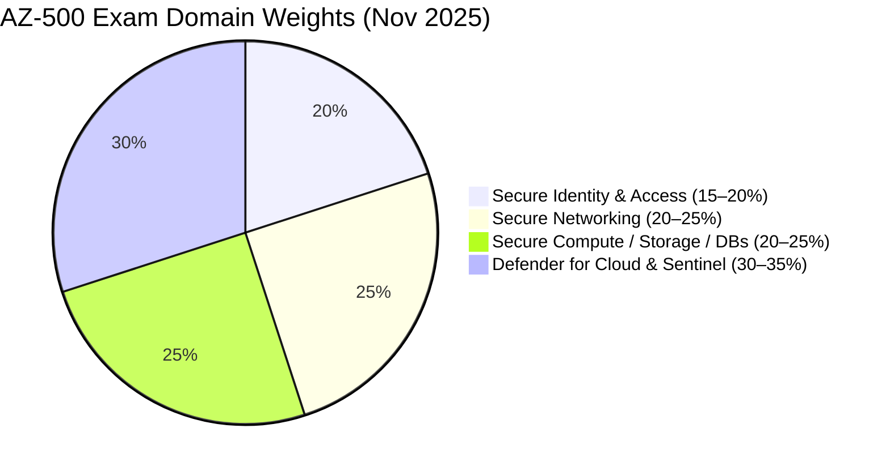

# 🔐 AZ-500: Azure Security Technologies
{: .fs-9 }

Study Notes & Exam Prep for the **Microsoft Certified: Azure Security Engineer Associate** certification.
{: .fs-6 .fw-300 }

[View on GitHub](https://github.com/marcogrimaldi29/az-500-study-notes){: .btn .fs-5 .mb-4 .mb-md-0 target="_blank" }

[Get Started →](){: .btn .btn-primary .fs-5 .mb-4 .mb-md-0 .mr-2 }
[Official Exam Page](https://learn.microsoft.com/en-us/credentials/certifications/azure-security-engineer/){: .btn .fs-5 .mb-4 .mb-md-0 }

---

> 🏠 These notes are maintained by **[Marco Grimaldi](https://www.linkedin.com/in/marco-grimaldi29/){:target="_blank"}** and based on the **[official Microsoft documentation](https://learn.microsoft.com/en-us/credentials/certifications/azure-solutions-architect/){:target="_blank"}**.
> Find more certification guides, study tips, and tech content at **[marcogrimaldi29.com](https://marcogrimaldi29.com){:target="_blank"}**.
> *Not affiliated with or endorsed by Microsoft. Always verify against the latest Microsoft documentation.*

---

## 📊 Exam Domain Weights

---

## 🗺️ Quick Navigation

| # | File | Domain | Weight |
|---|------|---------|--------|
| 0 | [🔰 Azure Security Fundamentals]() | Zero Trust, MCSB, Defence in Depth | — |
| 1 | [🪪 Identity & Access]() | Entra ID, PIM, MFA, Conditional Access | 15–20% |
| 2 | [🌐 Secure Networking]() | NSG, Firewall, WAF, Private Endpoints | 20–25% |
| 3 | [💾 Compute, Storage & Databases]() | AKS, ADE, TDE, Key Vault, SQL | 20–25% |
| 4 | [🛡️ Defender for Cloud & Sentinel]() | Defender plans, Secure Score, SIEM/SOAR | 30–35% |
| 5 | [⚡ Quick Reference Cheatsheet]() | Key facts, exam traps, final checklist | All |

---

## 🌐 Published Website

These notes are hosted on **GitHub Pages** and published as a searchable website on this URL:

👉 **[marcogrimaldi29/az-500-study-notes](https://marcogrimaldi29.com/az-500-study-notes/)**

The site includes full-text search, Mermaid diagram rendering, and mobile-friendly navigation for on-the-go review. 

These notes are designed to be a structured, exam-focused summary of the most important concepts and services baseds on the official [Microsoft Study Guide](https://learn.microsoft.com/en-us/credentials/certifications/resources/study-guides/az-500) and its criteria.

---

## ✍️ About the Author

These notes are maintained by **[Marco Grimaldi](https://www.linkedin.com/in/marco-grimaldi29/){:target="_blank"}** — Cloud Consultant, Language Trainer & Lifelong Learner.

📍 **Find more content at [marcogrimaldi29.com](https://marcogrimaldi29.com){:target="_blank"}**

> The website is continuously updated and based on my personal study notes and experiences. If you have any feedback, suggestions, or corrections, feel free to [reach out](https://marcogrimaldi29.com/contact/)!

---

## ©️ Credits & Acknowledgements

The [Just the Docs](https://github.com/just-the-docs/just-the-docs) theme is used for a clean, documentation-style layout that emphasizes readability and quick reference. Licensed under [MIT](https://opensource.org/license/MIT).

[Claude Sonnet 4.6](https://www.anthropic.com/news/claude-sonnet-4-6) was used for initial content generation and structuring, with all final edits, fact-checking, and formatting done by the author.

---